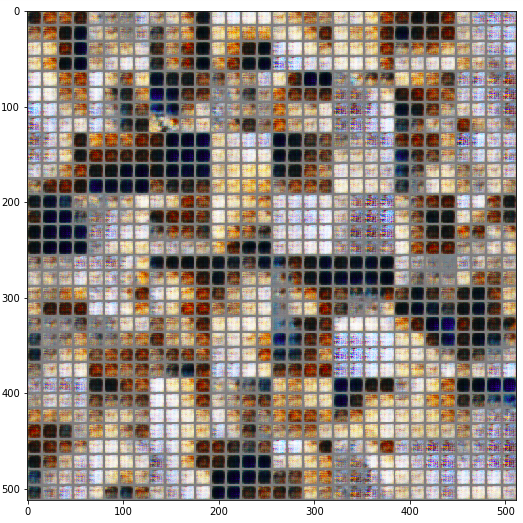

# Generative Adversarial Networks
This repository contains implementation of various architectures of Generative Models.

## Papers to read
- [Generative Adversarial Networks](https://papers.nips.cc/paper/5423-generative-adversarial-nets.pdf) by Ian Goodfellow et al.
- [Wasserstein GAN](https://arxiv.org/abs/1701.07875) by Soumith et al.
- [Improved training of Wasserstein GANs](https://arxiv.org/abs/1704.00028) by Arjovsky et al.
- [Unpaired Image-to-Image Translation using Cycle-Consistent Adversarial Networks](https://arxiv.org/abs/1703.10593) by Zhu et al.

## Implemented architectures
- GANs
- Wasserstein GANs
- WGANs with improved training
- CycleGANs (soon)

## Prerequisites
- Tensorflow
- Pytorch
- Numpy
- Fastai (Download it from [here](https://github.com/fastai/fastai))

Usage of GPU is highly recommended. 

## Datasets used
- [LSUN (Large Scale Scene Understanding Challenge)](http://lsun.cs.princeton.edu/) 
- [MNIST](http://yann.lecun.com/exdb/mnist/)

## Cloning the Repository
```
$ git clone https://github.com/prajjwal1/gans
```

## Wasserstein GANs
To train the model:
```
$ cd WGAN
$ python wgan_core.py
```
You can tune hyperparamter as per your own use and feel free to experiment it on different datasets. Change the PATH properly as per your setup.

## Results on datasets
### LSUN


The model has been trained for 250 epochs on this [dataset](https://www.kaggle.com/jhoward/lsun_bedroom). The original dataset is very large (43 GB). Trained on NVIDIA GTX 1080. To get a much more clear output, use the whole dataset with 500 epochs.


### MNIST
  
This was trainind on CPU for 10-20 epochs.

## Note
This repository is under constant development. Will be updated regularly. For Academic Research only